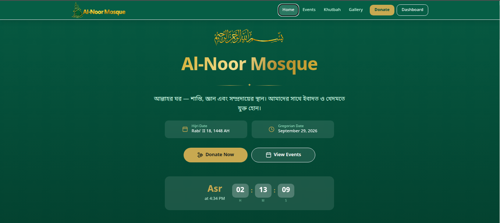
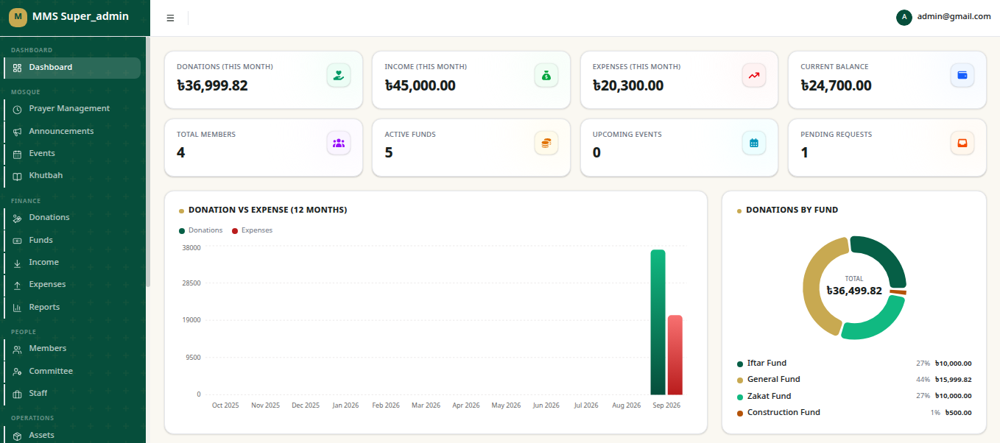
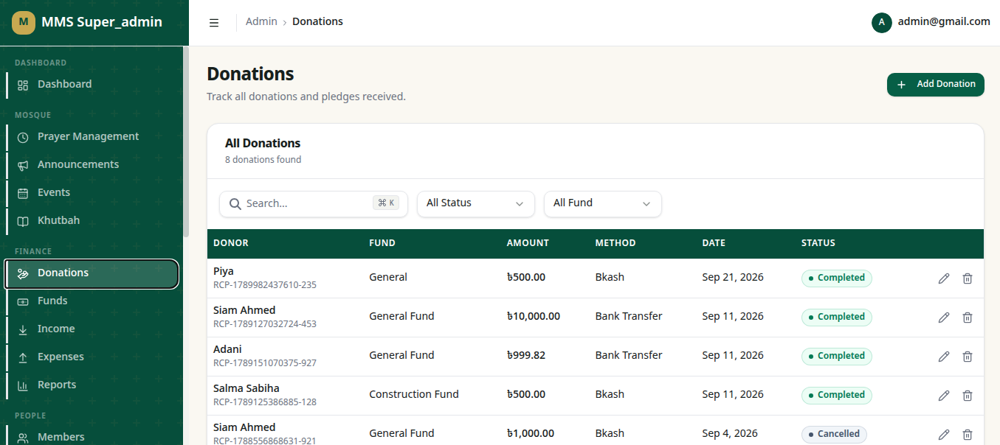
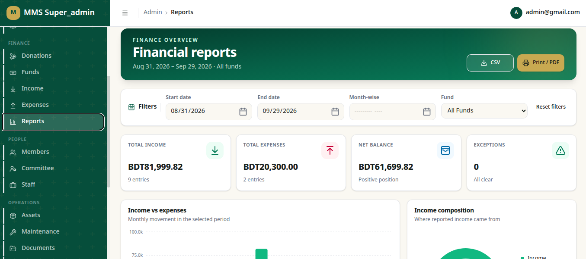
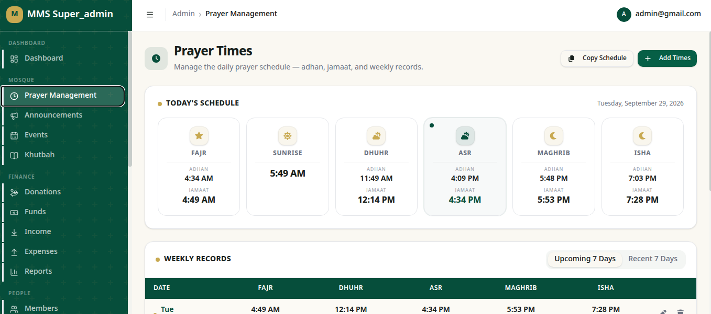
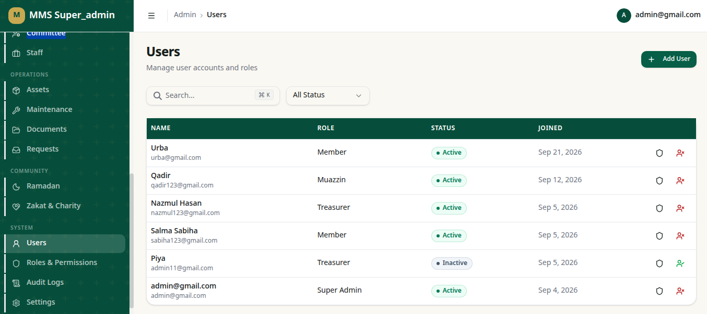

# Mosque Management System (MMS)

<p align="center">
  
  
  
  
</p>

A modern, production-ready mosque management platform that combines a public-facing community website with a secure, role-based admin dashboard for managing operations, funding, events, and community members.

Built for mosques and Islamic centers that need a single system to manage worship services, financial records, communication, and administration from one place.

## Live Demo

[](https://alnoormosque.vercel.app/)

## Screenshots

<p align="center">
  
  
</p>

<p align="center">
  
  
</p>

<p align="center">
  
  
</p>

## Project Highlights

<table>
  <tr>
    <td align="center"><strong>🏛️ Community Platform</strong><br />Public website for mosque updates, prayer times, and announcements</td>
    <td align="center"><strong>💰 Finance Tracking</strong><br />Donation, expense, fund, and income management with reporting</td>
  </tr>
  <tr>
    <td align="center"><strong>👥 Member Management</strong><br />Members, staff, committee, roles, and permission controls</td>
    <td align="center"><strong>📊 Operational Insights</strong><br />Reports, activity logs, and admin dashboards for decision making</td>
  </tr>
</table>

## Why MMS?

- Manage mosque operations from a single dashboard
- Keep public content updated with announcements, prayer times, and events
- Track donations, expenses, and funds with financial transparency
- Handle members, staff, committee roles, and permissions cleanly
- Maintain a professional digital presence for the community

---

## Features

### Public Website

- Homepage with prayer times and next prayer countdown
- Events and announcement sections
- Khutbah archive and community content pages
- Committee and gallery pages
- Donation page with Bangladeshi Taka support
- Contact page and public inquiry handling
- SEO metadata, sitemap, robots configuration, and manifest support

### Admin Dashboard

- Donation, income, expense, and balance overview
- Charts for donation trends and fund allocation
- Roles and permissions management
- Members, committee, staff, and user controls
- Prayer time management and operational records
- Assets, maintenance, documents, and request workflows
- Ramadan, audit logs, and settings modules

### Security & Access Control

- Supabase authentication integration
- Role-based access control (RBAC)
- Permission checks enforced in logic and database policy layers
- Secure server/client separation for sensitive operations

---

## Tech Stack

| Layer | Technology |
| --- | --- |
| Frontend | Next.js 16, React 19, TypeScript |
| Styling | Tailwind CSS v4 |
| UI Components | Radix UI, Lucide React |
| Forms | React Hook Form, Zod |
| Data Tables | TanStack Table |
| Charts | Recharts |
| Backend | Supabase (PostgreSQL, Auth, Storage, RLS) |
| Notifications | Sonner |
| Utilities | clsx, tailwind-merge, date-fns |

---

## Project Structure

```bash
.
├── src/
│   ├── app/
│   │   ├── (public)/          # public-facing pages
│   │   ├── (auth)/            # login and auth flows
│   │   ├── admin/             # protected admin dashboard
│   │   ├── api/               # API routes
│   │   └── auth/              # OAuth/callback routes
│   ├── components/
│   │   ├── admin/             # dashboard and admin UI
│   │   ├── forms/             # reusable form components
│   │   ├── public/            # public-facing UI
│   │   └── ui/                # shadcn-style primitives
│   ├── lib/
│   │   ├── actions/           # server actions
│   │   ├── auth/              # auth helpers
│   │   ├── queries/           # data fetchers
│   │   ├── permissions/       # RBAC rules
│   │   ├── supabase/          # Supabase clients
│   │   ├── utils/             # formatting and helpers
│   │   ├── validations/       # Zod schemas
│   │   └── prayer-times.ts    # time-related logic
│   ├── constants/
│   ├── types/
│   └── proxy.ts               # proxy/middleware replacement for Next 16
├── supabase/
│   ├── migrations/
│   └── seed.sql
├── public/
├── package.json
├── next.config.ts
├── tsconfig.json
├── eslint.config.mjs
├── README.md
└── .env.example
```

---

## Getting Started

### Prerequisites

- Node.js 18.18+ (recommended: Node 20 LTS)
- A Supabase project
- A configured local environment for development

### Installation

```bash
npm install
```

### Run the app

```bash
npm run dev
```

Then open:

```text
http://localhost:3000
```

---

## Environment Variables

Create a `.env.local` file in the project root using the following values:

```env
NEXT_PUBLIC_SUPABASE_URL=https://your-project.supabase.co
NEXT_PUBLIC_SUPABASE_ANON_KEY=your-anon-key
SUPABASE_SERVICE_ROLE_KEY=your-service-role-key
NEXT_PUBLIC_APP_URL=http://localhost:3000
```

### Variable Notes

- `NEXT_PUBLIC_SUPABASE_URL`: Your Supabase project URL
- `NEXT_PUBLIC_SUPABASE_ANON_KEY`: Public anon key for browser access
- `SUPABASE_SERVICE_ROLE_KEY`: Server-side secret; keep it private
- `NEXT_PUBLIC_APP_URL`: Base URL used by the app in local or production environments

---

## Database Setup

Apply the database schema and policies from the Supabase migrations.

```bash
# If you use the Supabase CLI
supabase db push
```

Or import the SQL files manually from the `supabase/migrations/` directory in the Supabase SQL editor.

Then seed initial data using:

```bash
supabase/seed.sql
```

This file contains initial records such as roles, funds, and default system data. For the first admin user, create the account in the Supabase Auth dashboard and update the corresponding profile record to assign the appropriate role, such as `super_admin`.

---

## Available Scripts

```bash
npm run dev     # start development server
npm run build   # production build
npm run start   # run production build
npm run lint    # run ESLint
```

---

## Notes

- Currency is handled in Bangladeshi Taka (`৳`)
- The donation flow is designed for manual payment tracking rather than a third-party payment gateway
- This project uses modern Next.js conventions; in Next 16, the role of middleware is handled through the app proxy setup in `src/proxy.ts`

---

## Contributing

Contributions are welcome. If you want to improve the application, please open an issue or submit a pull request with a clear description of the change.

---

## Project Status

This project is under active development and is designed for mosque administration workflows, community engagement, and operational reporting.
